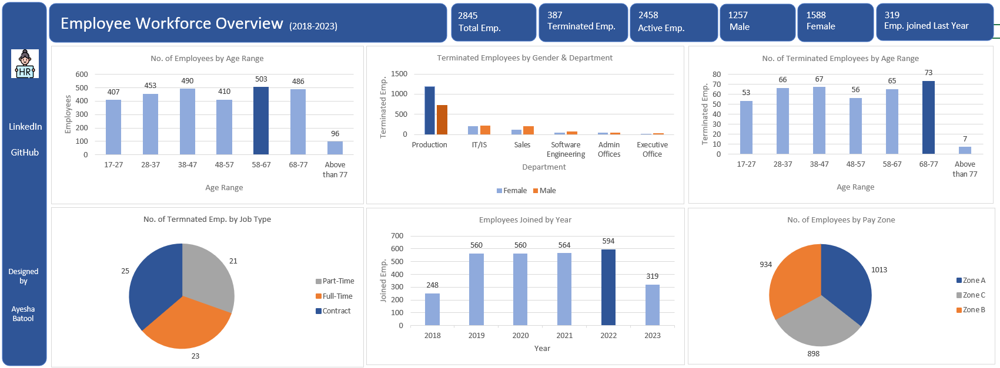

# Employee Workforce Analysis | Excel

Rather than viewing employee records as individual data points, I approached the workforce data through key HR business questions:

- What does the current workforce composition look like?
- Which departments experience higher employee turnover?
- Are there patterns in employee terminations by age, gender, and job type?
- How has employee hiring changed over time?

---

## Overview

This project analyzes employee workforce data from **2018 to 2023** using Microsoft Excel.
The analysis focuses on understanding workforce structure, employee retention, termination patterns, demographics, and hiring trends to identify areas where HR teams can investigate workforce challenges and improve employee management strategies.

## Dashboard Preview

---

# Analysis

## 1. Workforce Overview

### Questions Analyzed
- What is the current workforce size?
- How many employees are active versus terminated?
- What is the gender distribution?
- How many employees joined in the latest year?

### Findings

- The dataset contains **2,845 employees**, including:
  - **2,458 active employees**
  - **387 terminated employees**

- Female employees represent the larger share of the workforce:
  - Female: **1,588 employees**
  - Male: **1,257 employees**

- A total of **319 employees joined in 2023**, indicating continued workforce expansion.

---

## 2. Employee Distribution by Age

### Questions Analyzed
- How is the workforce distributed across age groups?
- Which age segments represent the largest employee groups?

### Findings

The largest employee groups are:

- **58-67 age range:** 503 employees
- **38-47 age range:** 490 employees
- **68-77 age range:** 486 employees

Employees above 77 represent the smallest group with:

- **96 employees**

---

## 3. Employee Turnover Analysis

### Questions Analyzed

- Which departments experience the highest number of employee terminations?
- Are termination patterns different across genders?
- Which age groups have higher termination counts?

### Findings

- The **Production department experienced the highest number of terminated employees**, significantly higher than other departments.

- Termination volume was highest among employees aged:

  - **68-77 years:** 73 employees
  - **38-47 years:** 67 employees
  - **28-37 years:** 66 employees

The termination patterns highlight departments and workforce segments that may require further investigation to understand employee retention challenges.

---

## 4. Hiring Trend Analysis

### Questions Analyzed

- How has employee hiring changed over time?
- Are there periods of significant workforce growth?

### Findings

Employee hiring increased significantly after 2018:

- **2018:** 248 employees joined
- **2019:** 560 employees joined
- **2022:** 594 employees joined

Hiring peaked in **2022 with 594 new employees**.

---

## 5. Workforce Distribution by Pay Zone

### Questions Analyzed

- How is the workforce distributed across different pay zones?

### Findings

- Zone A has the highest number of employees:
  - **1,013 employees**

- Zone C has the lowest workforce representation:
  - **898 employees**

- Workforce distribution is relatively balanced across all three pay zones.

---

# Dashboard

The interactive Excel dashboard provides an overview of:

- Workforce KPIs
- Employee demographics
- Employee turnover analysis
- Hiring trends
- Department-level workforce patterns

---

# Tools

- Microsoft Excel

---

# Skills Applied

- Data Cleaning
- Exploratory Data Analysis (EDA)
- Advanced Formulas
- Data Visualization
- KPI Development
- HR Analytics
- Business Insight Generation

---

### Let's Connect
- [LinkedIn](https://www.linkedin.com/in/ayesha-analyst/)
- [Email](ayeshabatool160@gmail.com)
